Building the Legs
=================

Parts Required
--------------

Metal Brackets
**************

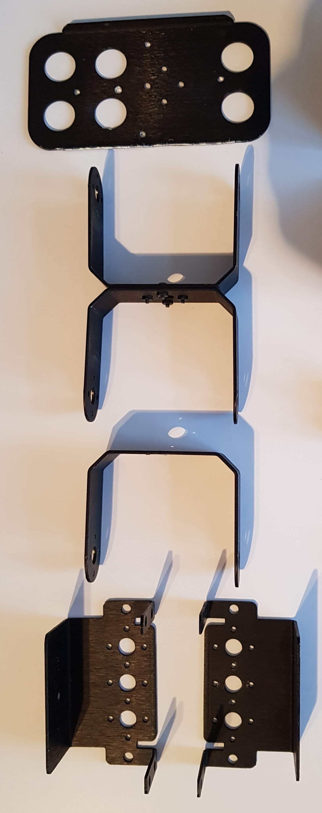

=============================   ========   =============== 
          Part Name             Quantity   Purchasing Link  
=============================   ========   =============== 
Motor Holder                    2          
U Bracket                       3
Foot                            1
=============================   ========   ===============

3D Prints
*********

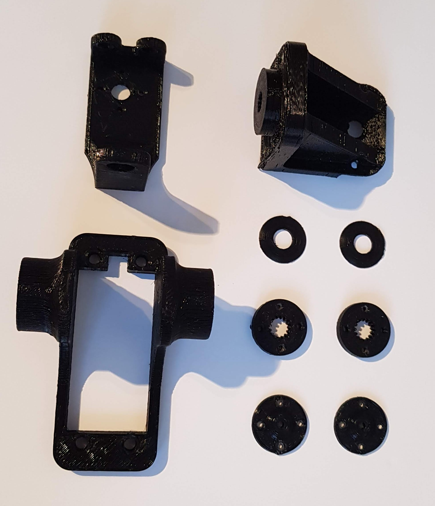

=============================   ========   =============== 
          Part Name             Quantity   Purchasing Link  
=============================   ========   ===============
**3D Prints**
Washer                          2
Motor Grip                      2
Motor Grip Plate                2
Hip Joint                       1
Ankle                           1
Hip Motor Holder                1
=============================   ========   ===============

Fasteners
*********

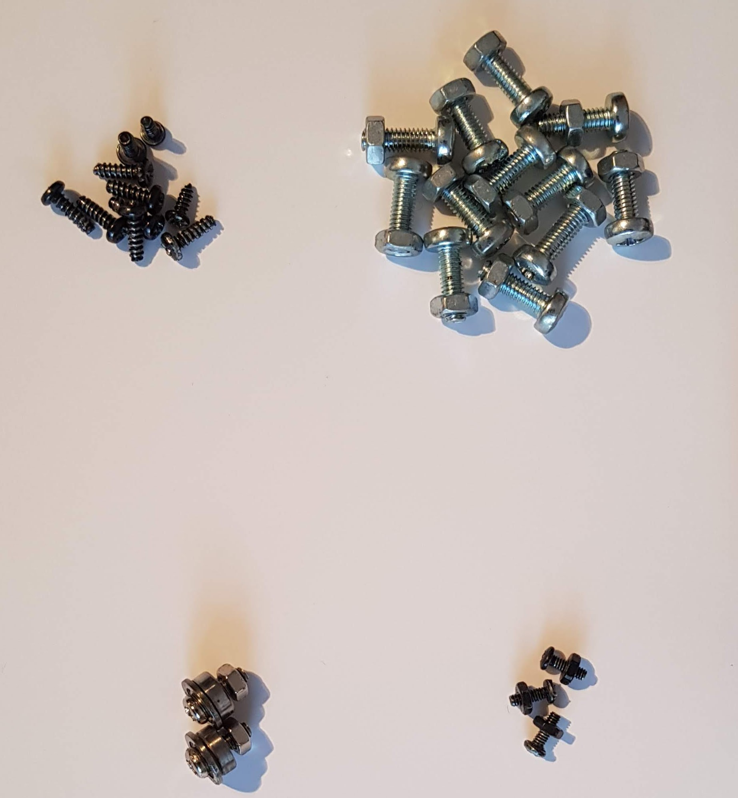

=============================   ========   =============== 
          Part Name             Quantity   Purchasing Link  
=============================   ========   ===============
Bearing and Screw               2
M4x12 Bolt                      12
M4 Nut                          12
Mini Black Screw                10
Mini Black Bolt + Nut           7
=============================   ========   ===============

Misc
****

=============================   ========   =============== 
          Part Name             Quantity   Purchasing Link  
=============================   ========   ===============
HS5765 Servo Motor              3
=============================   ========   ===============

Assembling the Foot
-------------------

Attach the metal foot to the metal servo mount

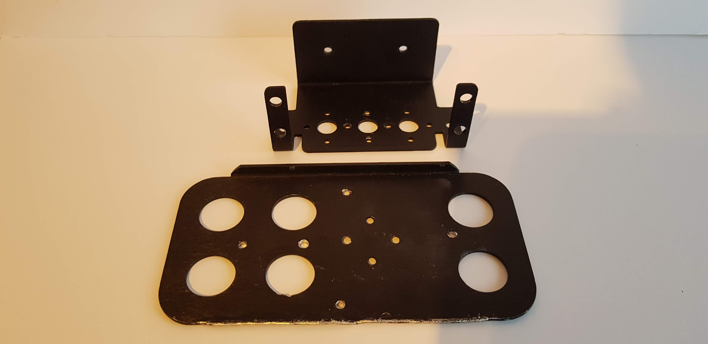

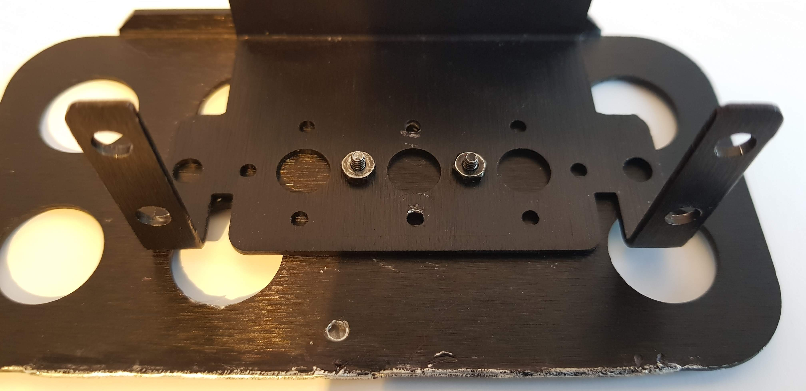

Attach the 3D printed ankle to a metal U connector

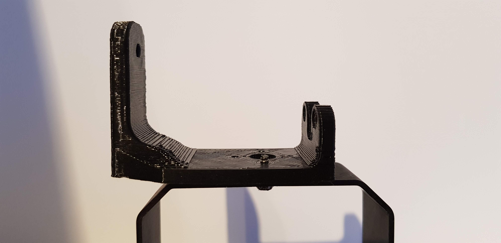

Place the bearing into the metal U connector, place the 3D printed washer over the top and secure this to the foot

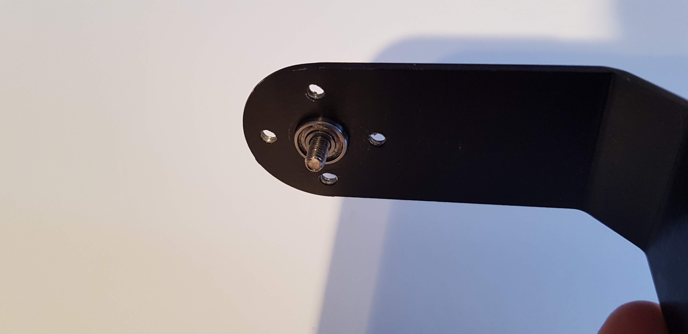

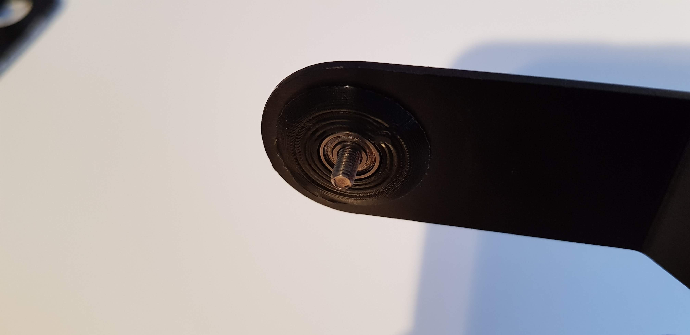

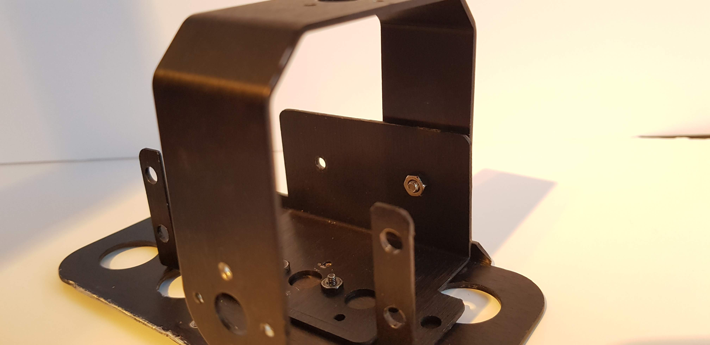

Attach a motor grip to a motor

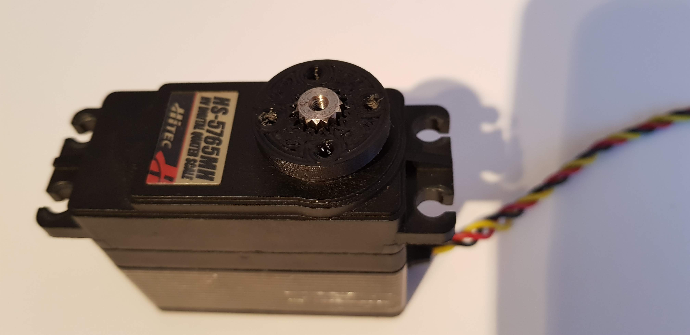

Place the motor in the motor bracket and secure it to the bracket and U connector

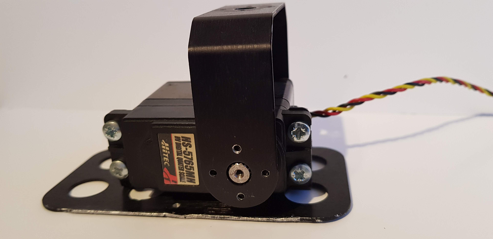

.. image:: Photos/Leg/20180602_211743.jpg
    :height: 250px

Foot assembly is now complete!

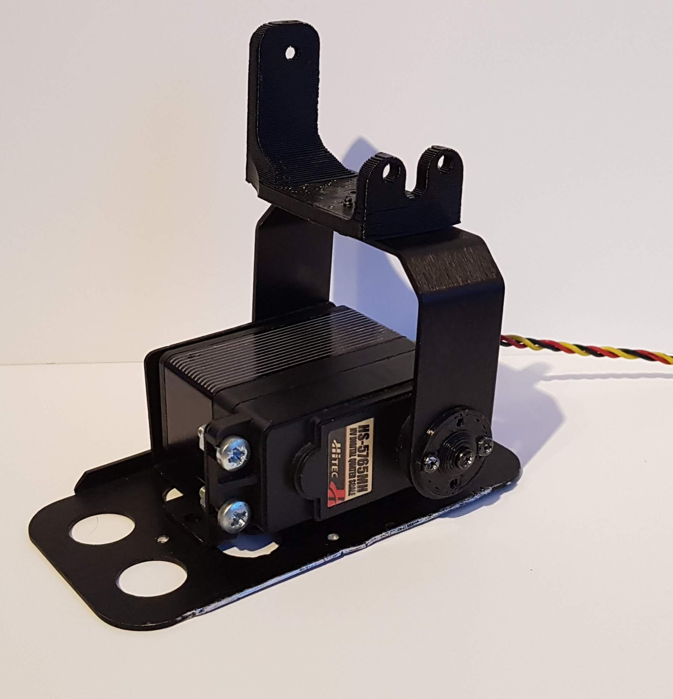
